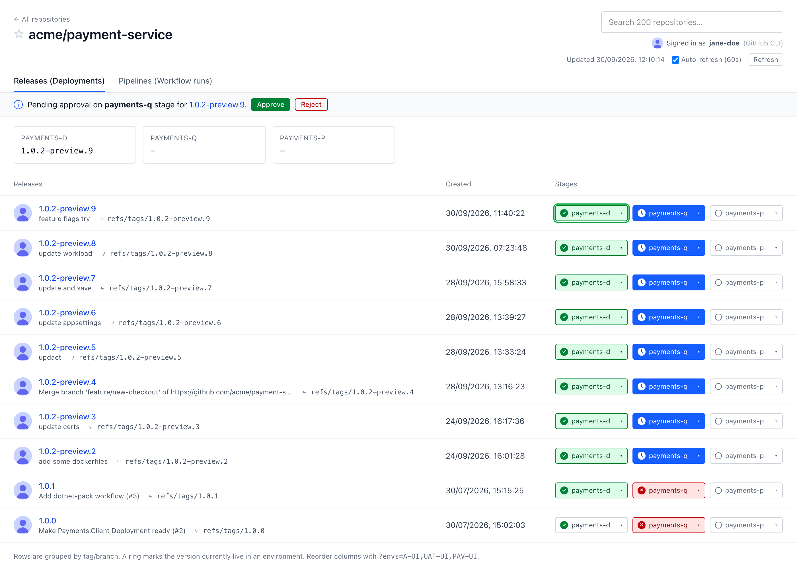
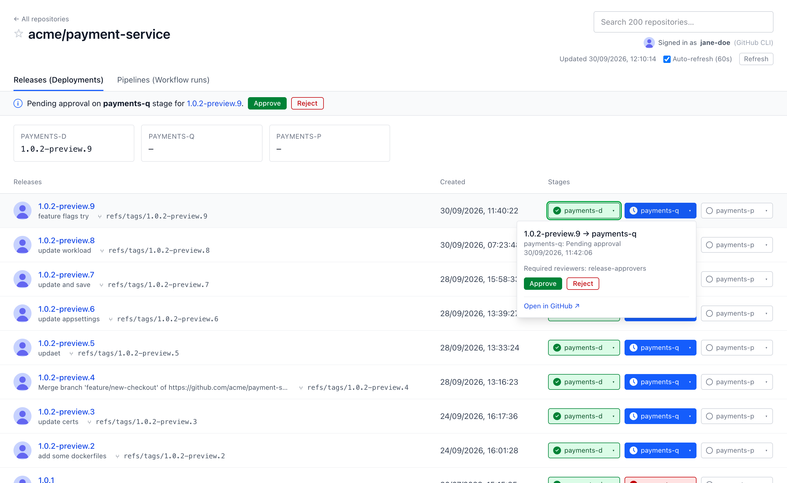
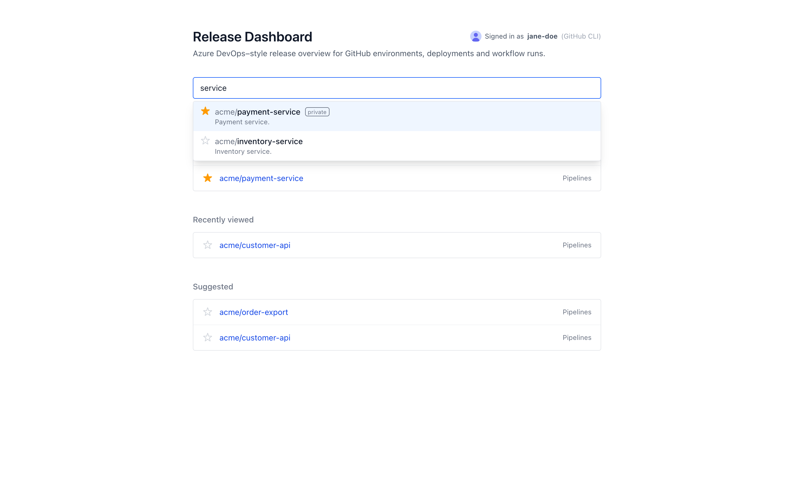
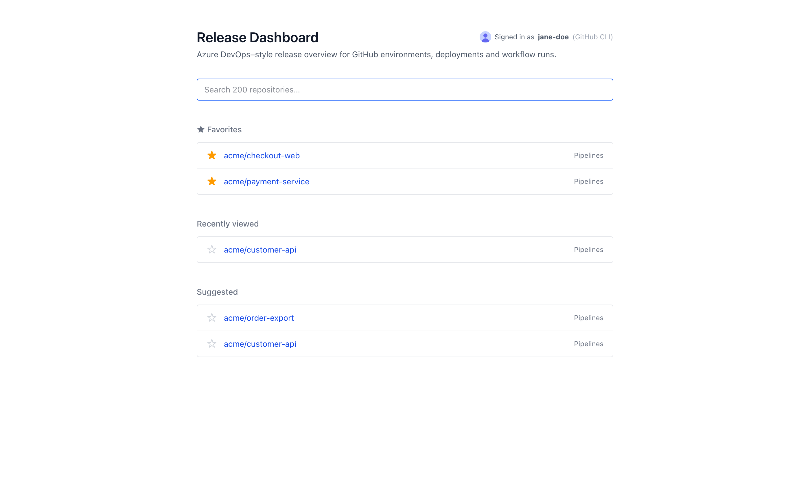
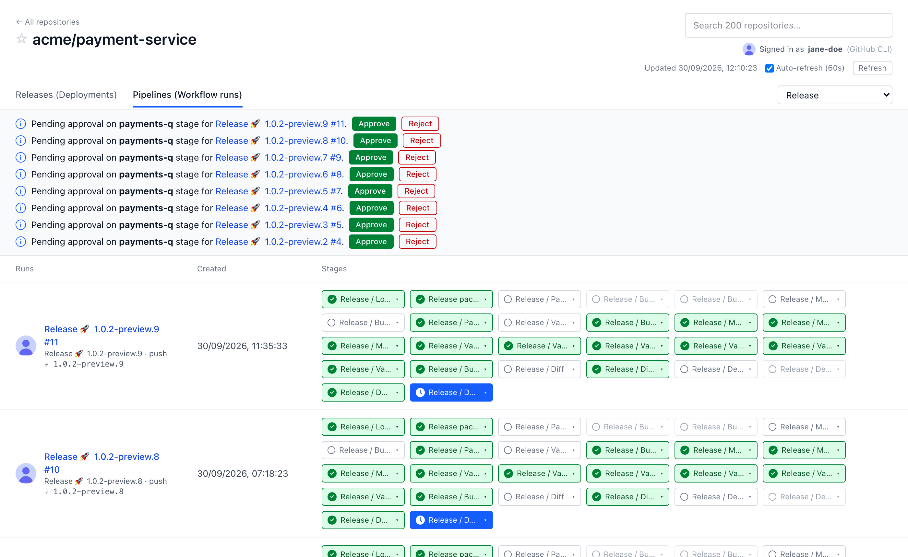
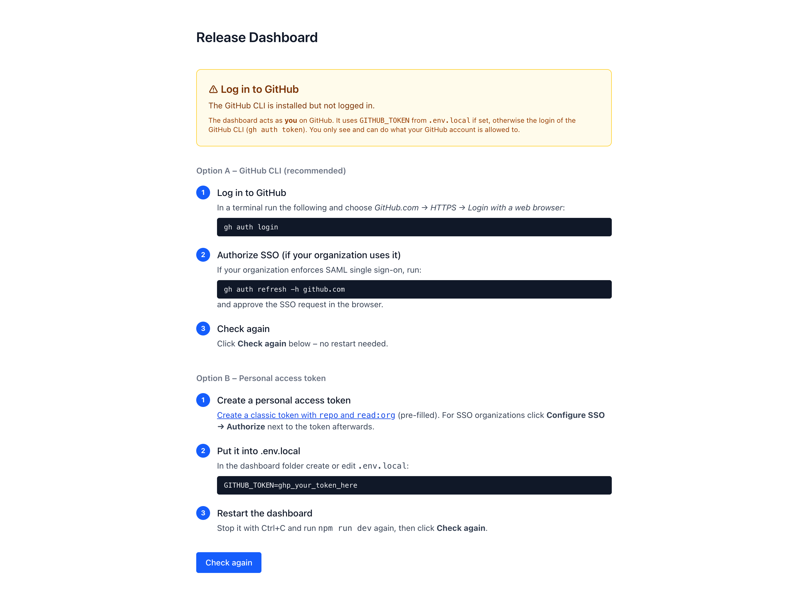

<div align="center">

# 🚀 Release Dashboard

**The Azure DevOps "Releases" view, for GitHub.**<br>
See every release across every environment at a glance, and approve or redeploy without leaving the page.


[Features](#-features) · [Quick start](#-quick-start) · [Configuration](#%EF%B8%8F-configuration) · [How it works](#-how-it-works) · [Troubleshooting](#-troubleshooting)

<br>



<sub>Screenshots use anonymized repository, user and environment names.</sub>

</div>

## 🤔 Why?

GitHub has environments, deployments and approval gates, but no single page that answers *"which version is running where, and what's waiting for me?"*. Azure DevOps has one. This dashboard brings it to GitHub:

- **One row per release** (tag, branch or commit), **one column per environment**, coloured by status.
- **Approve, reject and redeploy** right from the overview. No clicking through Actions runs.
- **Runs on your machine with your own GitHub login.** No server, no extra permissions, nothing to install in your repositories.

## ✨ Features

<table>
  <tr>
    <td width="42%" valign="top">
      <h3>📋 Releases at a glance</h3>
      <p>GitHub Deployments grouped by tag or branch, with one column per environment in pipeline order.</p>
      <ul>
        <li>Cards show the <b>version currently live</b> in each environment.</li>
        <li>A ring marks the live version's chip.</li>
        <li>A banner lists <b>pending approvals</b> with Approve / Reject buttons.</li>
        <li>Auto-refresh every 60 seconds.</li>
      </ul>
    </td>
    <td width="58%"></td>
  </tr>
  <tr>
    <td width="58%"></td>
    <td width="42%" valign="top">
      <h3>✅ Approve & redeploy in place</h3>
      <p>Click any stage chip to open its menu:</p>
      <ul>
        <li><b>Approve / Reject</b> a pending gate, also for older releases that are still waiting.</li>
        <li><b>Redeploy &lt;version&gt; to &lt;stage&gt;</b>: re-run that stage and everything after it.</li>
        <li><b>Continue pipeline</b>: re-run failed or rejected jobs.</li>
        <li><b>Run again for &lt;tag&gt;</b>: start the whole pipeline for an older version.</li>
        <li><b>Open in GitHub</b>.</li>
      </ul>
      <p><b>+ New tag</b> creates a tag on any branch to start a release. It shows the latest release and preview, suggests the next version (release or preview, following your tag style) and blocks tags that already exist.</p>
      <p>Your environment protection rules always apply. GitHub decides who may approve or re-run.</p>
    </td>
  </tr>
  <tr>
    <td width="42%" valign="top">
      <h3>🔎 Find any repository</h3>
      <p>Start typing and get suggestions from <b>every repository you can access</b>, even if you don't know its exact name.</p>
      <ul>
        <li><b>★ Favorites</b> stay on the home page.</li>
        <li><b>Recently viewed</b> repositories are remembered.</li>
        <li><b>Suggested</b> repositories can be preset for your team.</li>
      </ul>
    </td>
    <td width="58%"><br><br></td>
  </tr>
  <tr>
    <td width="58%"></td>
    <td width="42%" valign="top">
      <h3>⚙️ Pipelines view</h3>
      <p>Every run of a GitHub Actions workflow, with <b>one chip per job</b>. Useful for repositories that don't use deployments.</p>
      <ul>
        <li>Pick the workflow from the dropdown. Release/deploy workflows are chosen by default.</li>
        <li>All pending approvals at the top.</li>
        <li>The same stage menu as in the Releases view.</li>
      </ul>
    </td>
  </tr>
  <tr>
    <td width="42%" valign="top">
      <h3>🧭 Built-in setup guide</h3>
      <p>If the dashboard can't reach GitHub as you, it says <b>what's wrong and exactly what to do</b>:</p>
      <ul>
        <li>GitHub CLI not installed or not logged in</li>
        <li>Token invalid, expired or missing scopes</li>
        <li>Corporate proxy blocking the connection</li>
      </ul>
      <p>Fix it, click <b>Check again</b>, done.</p>
    </td>
    <td width="58%"></td>
  </tr>
</table>

---

## ⚡ Quick start

**TL;DR**, if you already have Node.js 20.9+ and the GitHub CLI:

```bash
gh auth login
git clone <this-repo-url> release-dashboard && cd release-dashboard
npm install
npm run dev          # → http://localhost:3000
```

Step by step:

### 1. Prerequisites

| Tool | Version | Check |
|------|---------|-------|
| [Node.js](https://nodejs.org/) | **20.9 or newer** (LTS recommended) | `node -v` |
| [GitHub CLI](https://cli.github.com/) *(recommended)* | any | `gh --version` |

### 2. Authenticate with GitHub

Choose **one** option.

**Option A: GitHub CLI (easiest)**

```bash
gh auth login               # choose github.com, HTTPS, log in with a browser
gh auth status              # should show "Logged in to github.com"
```

The dashboard reuses the token from `gh auth token` automatically.

**Option B: Personal access token (PAT)**

Create a token at *GitHub → Settings → Developer settings → Personal access tokens* and put it in `.env.local` (see step 4).

| Token type | Required permissions |
|------------|----------------------|
| Classic | `repo` (add `read:org` so repositories from your organizations appear in search) |
| Fine-grained | Repository access to the repositories you need, plus: **Metadata** (read), **Contents** (**read & write**, for creating tags), **Deployments** (read), **Environments** (read), **Actions** (**read & write**, for approve, re-run and dispatch) |

> **Not sure it worked?** Just start the dashboard. It checks the login on every page. If something is wrong (gh not installed, not logged in, token invalid or expired, or proxy certificate problems) it shows a **step-by-step setup guide** instead of the dashboard, with a **Check again** button. When everything works, the header shows *Signed in as &lt;your login&gt;* and whether the token comes from the GitHub CLI or `.env.local`. A yellow banner warns if a classic token is missing the `repo` or `read:org` scope.

> **Organizations with SAML SSO:** after creating the token, click **Configure SSO → Authorize** next to it for your organization. Otherwise you'll get 403/404 errors. With the GitHub CLI, run `gh auth refresh -h github.com` and complete the SSO step.

### 3. Install

```bash
git clone <this-repo-url> release-dashboard
cd release-dashboard
npm install
```

> **Corporate network or proxy?** If `npm install` fails with `UNABLE_TO_GET_ISSUER_CERT_LOCALLY` or `SELF_SIGNED_CERT_IN_CHAIN`, see [Troubleshooting](#corporate-proxy--tls-errors).

### 4. Configure (optional)

```bash
cp .env.example .env.local
```

Edit `.env.local`:

```ini
# Leave empty to use `gh auth token`
GITHUB_TOKEN=
# Repositories shown as "Suggested" on the home page
DASHBOARD_REPOS=my-org/my-service,my-org/other-service
```

### 5. Run

```bash
npm run dev
```

Open **http://localhost:3000** in your normal browser (Chrome, Edge, Safari or Firefox). Search for a repository, then star it ☆ to keep it on the home page.

To use a different port: `PORT=3123 npm run dev` (Windows PowerShell: `$env:PORT=3123; npm run dev`).

### Production mode (faster, no hot reload)

```bash
npm run build
npm start                   # http://localhost:3000
```

---

## ⚙️ Configuration

All settings go in `.env.local`.

| Variable | Default | Description |
|----------|---------|-------------|
| `GITHUB_TOKEN` | output of `gh auth token` | Token used for all GitHub API calls |
| `DASHBOARD_REPOS` | – | Comma-separated `owner/repo` list shown as "Suggested" on the home page |
| `DASHBOARD_HIDE_ENVS` | `copilot` | Environments to hide (comma-separated) |
| `DASHBOARD_MAX_ROWS` | `20` | Releases or runs shown per page |
| `DASHBOARD_TIMEZONE` | `Europe/Zurich` | Timezone for dates |
| `GITHUB_API_URL` | `https://api.github.com` | REST API (for GitHub Enterprise Server: `https://<host>/api/v3`) |
| `GITHUB_GRAPHQL_URL` | `$GITHUB_API_URL/graphql` | GraphQL API (for GitHub Enterprise Server: `https://<host>/api/graphql`) |

URL options:

- `?envs=app-d,app-q,app-p`: show only these environments, in this order.
- `/r/<owner>/<repo>/workflows?workflow=<id>`: choose a workflow in the Pipelines view.

## 🔧 How it works

| View | GitHub API |
|------|------------|
| Releases | GraphQL `repository.deployments` and `environments` |
| Pipelines | REST `actions/workflows/{id}/runs`, `runs/{id}/jobs` |
| Approve / reject | `POST actions/runs/{id}/pending_deployments` |
| Redeploy stage | `POST actions/jobs/{id}/rerun` |
| Continue pipeline | `POST actions/runs/{id}/rerun-failed-jobs` |
| Run again for a tag | `POST actions/workflows/{id}/dispatches` |
| New tag | GraphQL `refs` (branches, tags), `POST git/refs` |

For deployments to show up, your workflow jobs must use GitHub environments:

```yaml
jobs:
  deploy-q:
    environment: app-q          # creates a deployment and enforces the environment's approval rules
    needs: deploy-d
```

## 🔒 Security

- The GitHub token stays on the server and is never sent to the browser.
- The server listens on **127.0.0.1 only**, because it acts as *you*, including approvals. Don't expose it on a network or share one instance between several people.
- Favorites and recently viewed repos are stored in your browser (`localStorage`).

## 🩺 Troubleshooting

The dashboard detects most setup problems itself and shows a guide on the start page:

| Message in the dashboard | Cause | Fix |
|---|---|---|
| *Connect the dashboard to GitHub* | No `GITHUB_TOKEN` and `gh` isn't installed (or not on `PATH`) | Install the GitHub CLI and restart, or set `GITHUB_TOKEN` |
| *Log in to GitHub* | `gh` is installed but not logged in | `gh auth login`, then **Check again** (no restart needed) |
| *Your GitHub login has expired* | GitHub rejected the token (401) | `gh auth login` again, or create a new PAT and restart |
| *Your network blocks the connection to GitHub* | TLS interception by a corporate proxy | See [Corporate proxy / TLS errors](#corporate-proxy--tls-errors) |
| *GitHub is not reachable* | No network / VPN, wrong `GITHUB_API_URL` | Check the connection |

### Corporate proxy / TLS errors

Your company proxy inspects HTTPS traffic with its own root certificate, and Node.js doesn't trust it by default.

**macOS:**

```bash
security find-certificate -a -p /Library/Keychains/System.keychain \
  /System/Library/Keychains/SystemRootCertificates.keychain > ~/.corp-ca.pem
echo 'export NODE_EXTRA_CA_CERTS=~/.corp-ca.pem' >> ~/.zshrc && source ~/.zshrc
```

**Windows (PowerShell):**

```powershell
Get-ChildItem Cert:\LocalMachine\Root | ForEach-Object {
  "-----BEGIN CERTIFICATE-----`n" + [Convert]::ToBase64String($_.RawData, 'InsertLineBreaks') + "`n-----END CERTIFICATE-----"
} | Set-Content -Encoding ascii $HOME\corp-ca.pem
[Environment]::SetEnvironmentVariable('NODE_EXTRA_CA_CERTS', "$HOME\corp-ca.pem", 'User')
# open a new terminal afterwards
```

Then run `npm install` and `npm run dev` again. The API calls to GitHub need the same variable.

### Other problems

| Symptom | Fix |
|---------|-----|
| `Resource protected by organization SAML enforcement` | Authorize your token for SSO (see step 2) |
| Repository not in search | The token has no access to it, or `read:org` is missing. Reload with `/api/repos?refresh` |
| No Approve button, only "Waiting for …" | You're not a required reviewer for that environment |
| "Re-run" options missing | You need write access, the run must be finished, and it must be at most 30 days old |
| Links do nothing inside an IDE's embedded browser | Some embedded browsers block new tabs; use a normal browser |

## 🛠️ Development

```bash
npm run dev        # dev server with hot reload
npx tsc --noEmit   # type check
npm run lint       # ESLint
npm run build      # production build
```

```
src/
  app/                          Next.js App Router
    page.tsx                    Home page (search, favorites)
    r/[owner]/[repo]/…          Releases and Pipelines views
    api/repos                   Repository list for search (cached for 10 min)
    api/stage-options           What can be done with a stage (loaded when a chip is clicked)
    api/tag-options             Branches, tags and version suggestions for "New tag"
    actions.ts                  Server actions: approve, reject, re-run, dispatch, create tag
  components/                   UI (MatrixTable, StageMenu, RepoPicker, …)
  lib/
    github.ts                   REST and GraphQL client, token handling
    data.ts                     Builds the release/stage matrix
    stageOptions.ts             Re-run and dispatch rules
    tags.ts                     Branches and tags for "New tag"
    versions.ts                 Version parsing and next-version suggestions
    model.ts                    Types and status mapping
```

Built with Next.js 16, React 19, TypeScript and Tailwind CSS 4.
